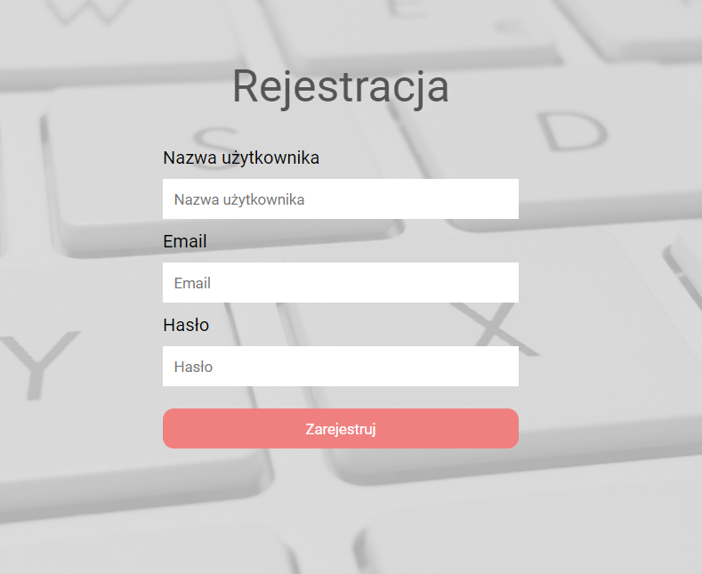
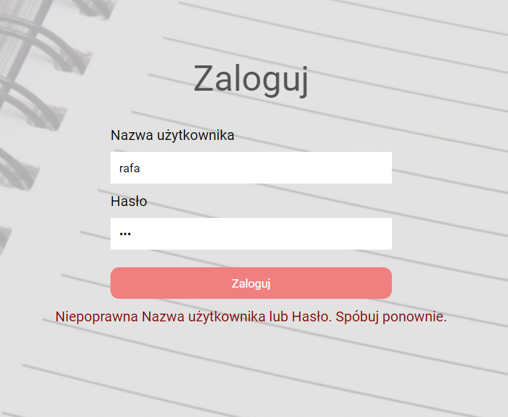
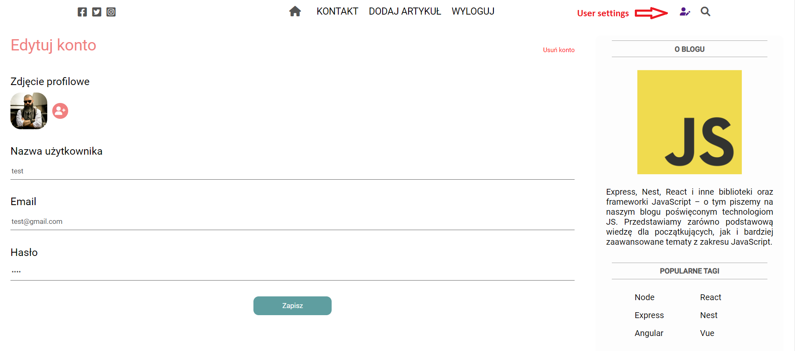
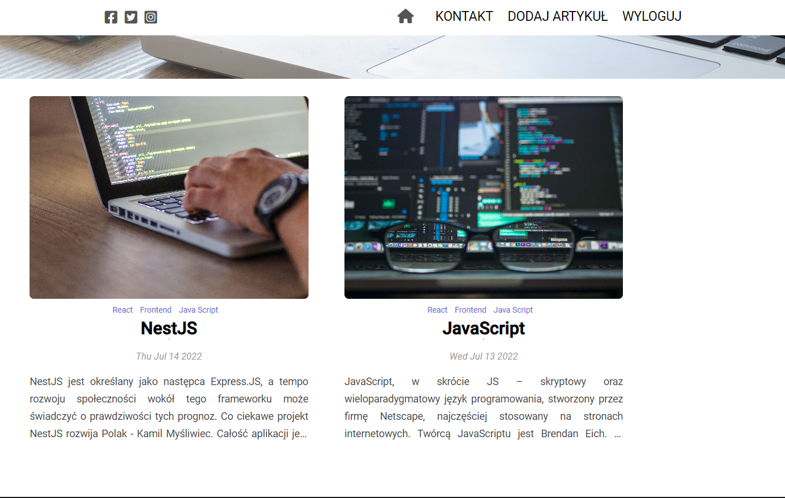
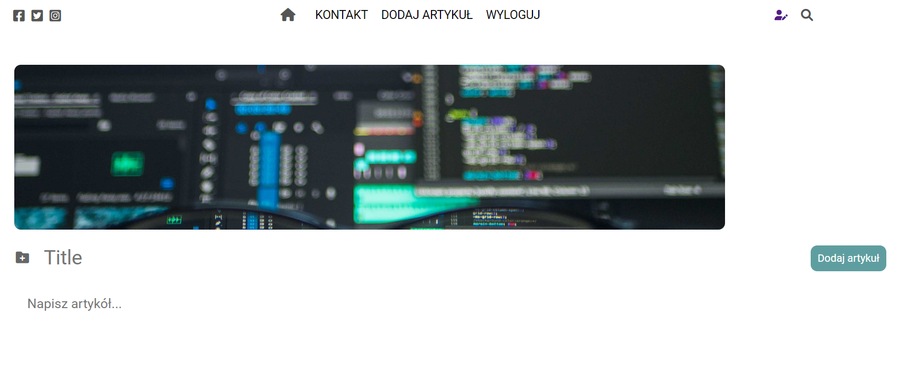
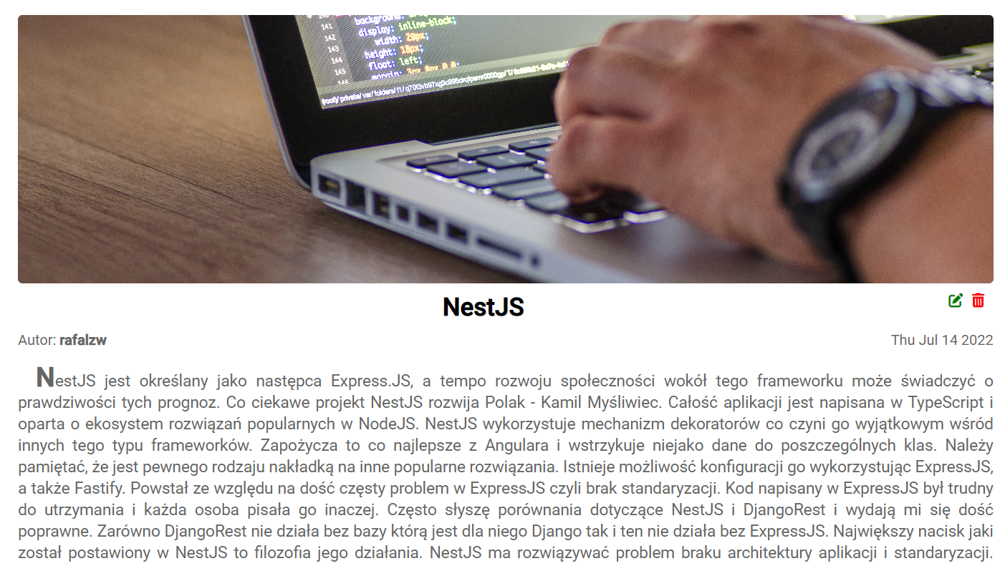

# JS-blog

## JS-blog - front v0.1.0
> Live demo [_here_](https://js-blog.networkmanager.pl/). <!-- If you have the project hosted somewhere, include the link here. -->

## Project Status
Project is: _in progress.

## General Information
- The idea of the project is to repeat and consolidate the knowledge acquired in the one-year MegaK course.
- The project will be a place to grow to implement other technologies for example Redux.

## Technologies Used
- ReactJS
- TypeScript
- react-router-dom
- axios

## Features
### List the ready features here:
### - Create new User:
  

### - User login and data validation:
  

### - Edit user with possibility to upload image:

### - Display all posts or posts of a single user:

### - Adding new posts only by logged-in user. possibility to upload image:

### - User can also edit and delete (CRUD) their posts:

## TODO

- implement Redux
- add #tags
- add pagination
- search engine connection
 